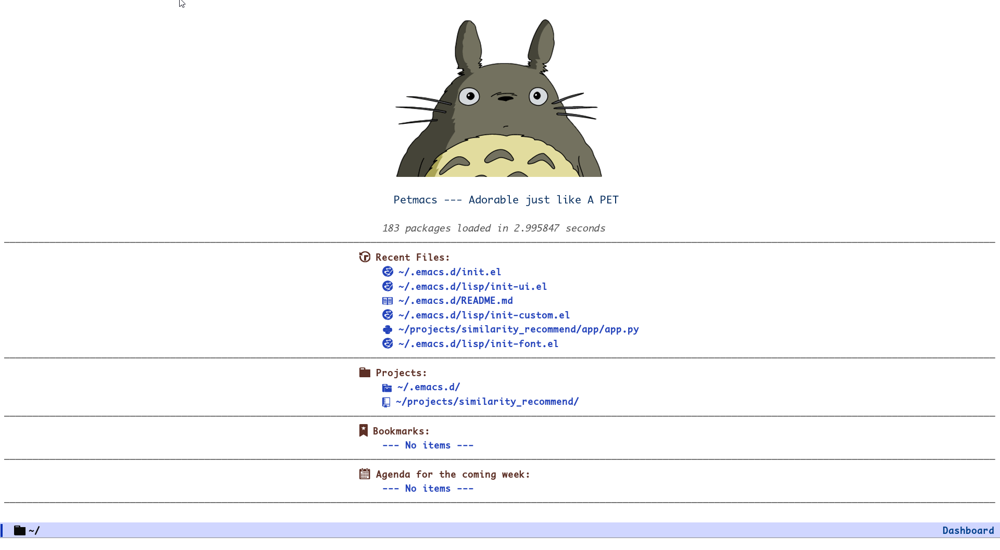
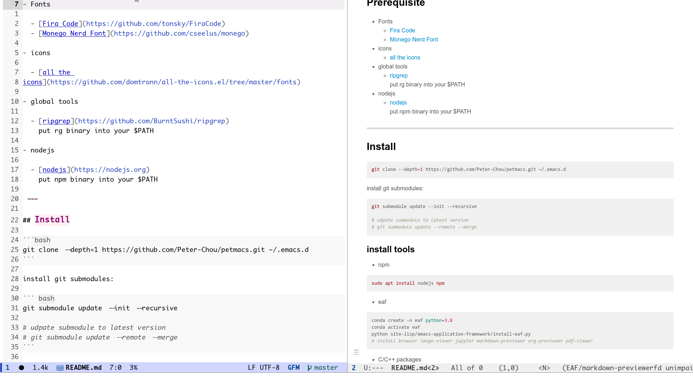
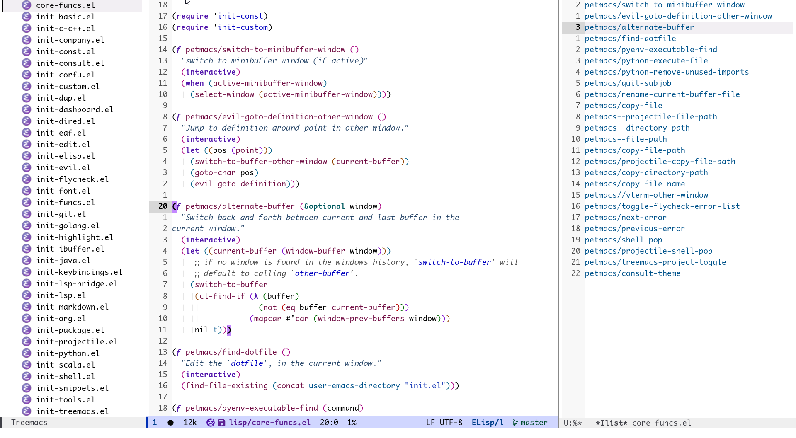

# Petmacs

---

## Prerequisite

- Fonts

  - [Fira Code](https://github.com/tonsky/FiraCode)
  - [Monego Nerd Font](https://github.com/cseelus/monego)

- icons

  - [all the icons](https://github.com/domtronn/all-the-icons.el/tree/master/fonts)

- global tools

  - [ripgrep](https://github.com/BurntSushi/ripgrep)
    put rg binary into your $PATH

- nodejs

  - [nodejs](https://nodejs.org)
    put npm binary into your $PATH

---

## Install

```bash
git clone --depth=1 https://github.com/Peter-Chou/petmacs.git ~/.emacs.d
```

install git submodules:

``` bash
git submodule update --init --recursive

# udpate submodule to latest version
# git submodule update --remote --merge
```

### install tools


- npm

``` bash
sudo apt install nodejs npm
```

- eaf

``` bash
conda create -n eaf python=3.8
conda activate eaf
python site-lisp/emacs-application-framework/install-eaf.py
# install browser image-viewer jupyter markdown-previewer org-previewer pdf-viewer
```

- C/C++ packages

lsp use clangd in LLVM project
dap use lldb-vscode in LLVM/lldb/tools/lldb-vscode (https://github.com/llvm-mirror/lldb/tree/master/tools/lldb-vscode)

- nodejs packages

```sh
npm install -g eslint_d prettier markdownlint-cli vmd
```

use mirror if you have timeout error.

---

## Screenshots






