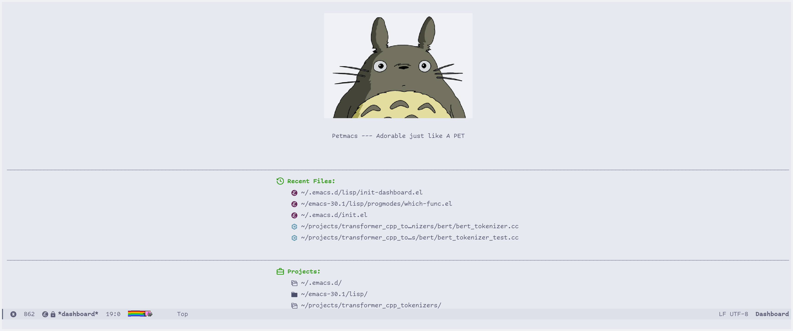
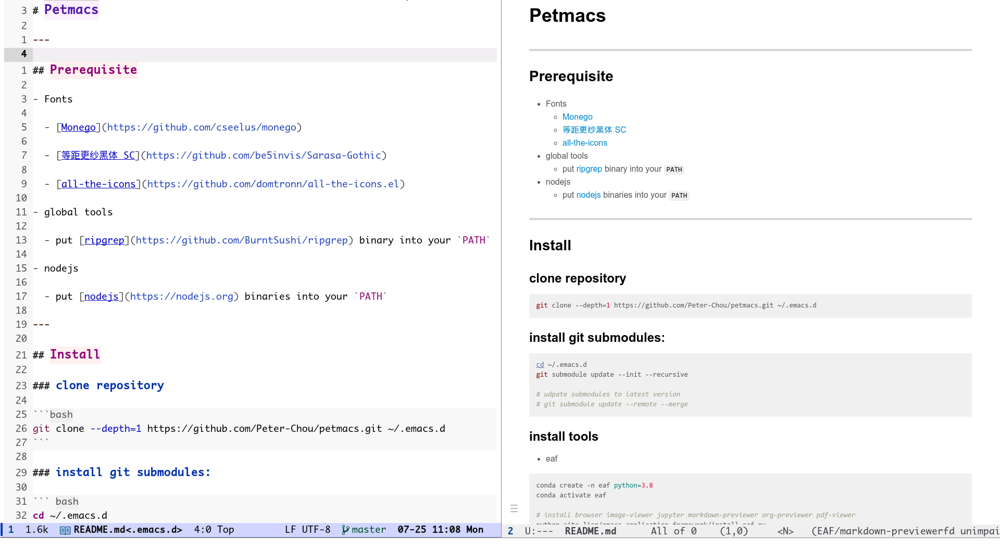
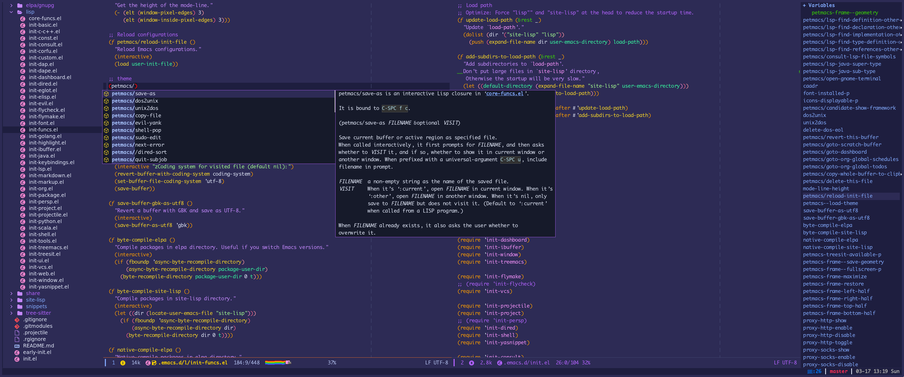

# Petmacs

---

## Prerequisites

- Fonts

  - [Monego Ligatures](https://github.com/cseelus/monego)

  - [Maple Mono SC NF](https://gitee.com/subframe7536/Maple/releases)

  - [all-the-icons](https://github.com/domtronn/all-the-icons.el)

- ripgrep

  put [ripgrep](https://github.com/BurntSushi/ripgrep) binary into your `PATH`

- nodejs

  put [nodejs](https://nodejs.org) binaries into your `PATH`

- rime

``` bash
sudo apt-get install librime-dev
sudo apt-get install librime-data-terra-pinyin  # 地球拼音
```

---

## Install

### clone repository

```bash
git clone --depth=1 https://github.com/Peter-Chou/petmacs.git ~/.emacs.d
```


### install tools

- eaf [Optional]

``` bash
# in .emacs.d folder
git submodule update --init --recursive

# udpate submodules to latest version
# git submodule update --remote --merge
```

``` bash
conda create -n eaf python=3.8
conda activate eaf

# install browser image-viewer jupyter markdown-previewer org-previewer pdf-viewer git
python site-lisp/emacs-application-framework/install-eaf.py
```

### install LSP servers

install the language servers needed by LSP service

- python

``` sh
npm install -g pyright
```

set WORKON_HOME environment variable that has virtual environment directories.

- C/C++

use `clangd` in [LLVM project](https://github.com/llvm/llvm-project). soft link llvm project to `/opt/llvm`.

- Golang

``` bash
go install golang.org/x/tools/gopls@latest
```

### install DAP servers

- python

``` bash
pip install debugpy
```

- C/C++

`lldb-vscode` is in LLVM project

- Golang

``` bash
go install github.com/go-delve/delve/cmd/dlv@latest
```

---


## Screenshots



<br>



<br>


