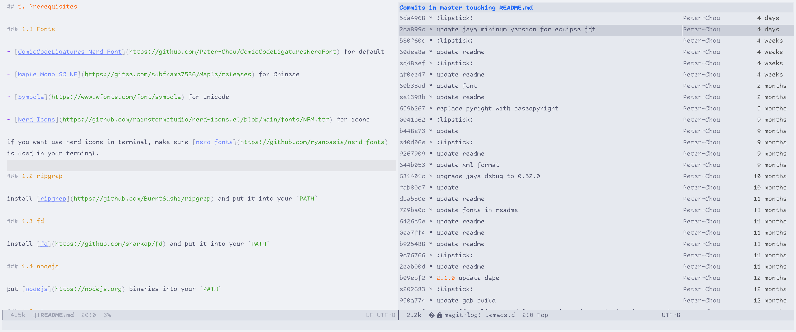

# Petmacs

before you use Petmacs, make sure your emacs version >= 29.1 and tree-sitter is enabled.

---

## 1. Prerequisites

### 1.1 Fonts

- [ComicCodeLigatures Nerd Font](https://github.com/Peter-Chou/ComicCodeLigaturesNerdFont) for default

- [Maple Mono SC NF](https://gitee.com/subframe7536/Maple/releases) for Chinese

- [Symbola](https://www.wfonts.com/font/symbola) for unicode

- [Nerd Icons](https://github.com/rainstormstudio/nerd-icons.el/blob/main/fonts/NFM.ttf) for icons

if you want use nerd icons in terminal, make sure [nerd fonts](https://github.com/ryanoasis/nerd-fonts) is used in your terminal.

### 1.2 ripgrep

install [ripgrep](https://github.com/BurntSushi/ripgrep) and put it into your `PATH`

### 1.3 fd

install [fd](https://github.com/sharkdp/fd) and put it into your `PATH`

### 1.4 nodejs

put [nodejs](https://nodejs.org) binaries into your `PATH`

### 1.5 rime

install [rime](https://github.com/rime/librime)

``` bash
# use terra-pinyin for chinese input
sudo apt-get install librime-dev fcitx-rime
```

### 1.6 snap (ubuntu)

``` bash
sudo apt-get update
sudo apt-get install snapd
```

add `/snap/bin` to `PATH`

### 1.7 libvterm (ubuntu)

``` bash
sudo apt-get install libvterm-dev
```

### 1.8 sqlite3 (ubuntu)

``` bash
# for magit
sudo apt-get install libsqlite3-dev
```

### 1.9 build tools

``` bash
# install build tools
sudo apt-get install build-essential ninja-build
sudo apt-get install cmake libtool-bin make
```

if your cmake is too old, download the suitable version from [cmake.org](https://cmake.org/download/)

### 1.10 ctags

``` bash
sudo apt-get install -y universal-ctags
```

### 1.11 jq

``` bash
sudo apt-get install -y jq
```

### 1.12 readability

``` bash
npm install -g readability-cli
```

---

## 2. Install

### 2.1 clone repository

```bash
git clone https://github.com/Peter-Chou/petmacs.git ~/.emacs.d
```

if you are facing some certification verification problems while cloning repository by git,
try use the following command and rerun emacs:

``` bash
export GIT_SSL_NO_VERIFY=1
```

### 2.2 install dynamic libs for tree-sitter

run the following command in emacs.

``` emacs-lisp
M-x treesit-auto-install-all
```

### 2.3 update builtin eglot to latest version

``` emacs-lisp
M-x eglot-upgrade-eglot
```

---

## 3. install LSP servers

### 3.1 basedpyright (Python)

``` sh
# in your python environment
pip install basedpyright
```

### 3.2 eclipse jdtls (Java)

Please make sure  java 21 is installed in `/opt/jdk21` folder and run following commands in emacs.

``` bash
M-x: eglot-java-upgrade-lsp-server
M-x: eglot-java-upgrade-junit-jar
```

### 3.3 clangd (C/C++)

use `clangd` in [LLVM project](https://github.com/llvm/llvm-project). soft link llvm project to `/opt/llvm`.

or you can build it from source

``` bash
llvm_version=llvmorg-20.1.6
git clone -b $llvm_version --depth=1 https://gitee.com/mirrors/LLVM.git $llvm_version
cd $llvm_version
cmake -S llvm -G Ninja -B build -DCMAKE_BUILD_TYPE=Release \
    -DLLVM_ENABLE_PROJECTS="clang;lld;clang-tools-extra;lldb" \
    -DLLVM_ENABLE_RUNTIMES="libcxx;libcxxabi;libunwind" \
    -DCMAKE_INSTALL_PREFIX=/opt/softwares/$llvm_version

cmake --build build -j $(nproc)
sudo $(which cmake) --install build
sudo ln -sf /opt/softwares/$llvm_version /opt/llvm
```

### 3.4 neocmakelsp (cmake)

download [neocmakelsp](https://github.com/neocmakelsp/neocmakelsp/releases) (musl version) and put it into your `PATH`.

### 3.5 docker-langserver (dockerfile)

``` sh
npm install -g dockerfile-language-server-nodejs
```

### 3.6 bash-language-server (bash/sh)

``` bash
npm install -g bash-language-server
```

---

## 4. install DAP servers

### 4.1 debugpy (Python)

``` bash
pip install debugpy
```

### 4.2 junit-platform-console-standalone (Java)

junit-platform-console-standalone is already installed in `M-x: eglot-java-upgrade-junit-jar` command

### 4.3 lldb-dap (C/C++)

lldb-dap (formerly lldb-vscode) is built and installed in section 3.3

---

## 5. install formatter

petmacs use [apheleia](https://github.com/radian-software/apheleia) to format the buffer.

### 5.1 ruff (Python)

install [ruff](https://github.com/astral-sh/ruff) in your environment.

``` bash
pip install ruff
```

### 5.2 google-java-format (Java)

``` bash
# for java >= 11
npm install -g google-java-format
# for java 8
npm install -g google-java-format@1.7
```

### 5.3 clang-format (C/C++)

`clang-format` is already in [LLVM project](https://github.com/llvm/llvm-project).

### 5.4 shfmt (bash/sh)

install [shfmt](https://github.com/mvdan/sh/releases) and put it into your `PATH`

### 5.5 prettier

``` bash
npm install -g prettier
```

formatter for `json`, `javascript`, `typescript`, `css`, `scss`, `html`, `graphql`, `markdown`, `yaml`

### 5.6 cmake-format (cmake)

``` bash
sudo apt-get install cmake-format
```

### 5.7 pg_format (SQL)

``` bash
sudo apt-get install pgformatter
```

### 5.8 dprint (dockerfile, toml)

``` bash
npm install -g dprint
```

### 5.9 xmllint (xml)

``` bash
sudo apt-get install libxml2-utils
```

---

## 6. Debug

You can add your test config to init-mini.el and use the following command to ease your debug process.

``` bash
emacs -Q -l ~/.emacs.d/init-mini.el
```

---

## 7. Screenshots


<br>



<br>


