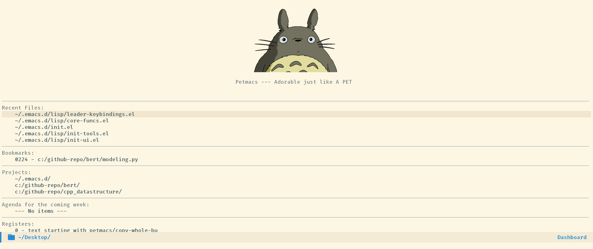

# Petmacs

---

## Prerequisite
Petmacs requires fonts for better display:

- Fonts

  - [Fira Code](https://github.com/tonsky/FiraCode)

  - [Fira Code Symbol](https://github.com/tonsky/FiraCode/files/412440/FiraCode-Regular-Symbol.zip)

  - [all the icons](https://github.com/domtronn/all-the-icons.el/tree/master/fonts)  

- Python related Packages

```sh
pip install pylint yapf isort
```

- nodejs packages

```sh
npm install -g eslint_d prettier markdownlint-cli vmd
```

use mirror if you have timeout error.

- C/C++ packages

build [ccls](https://github.com/MaskRay/ccls) language server at $HOME path

---

## Install

```bash
git clone https://github.com/Peter-Chou/petmacs.git ~/.emacs.d
```

---

## Screenshots




